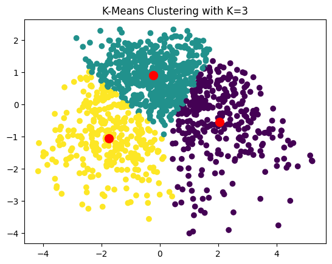
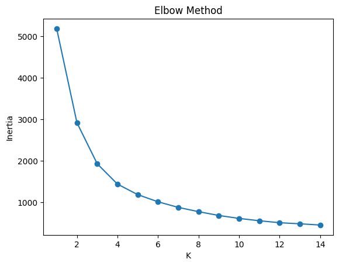
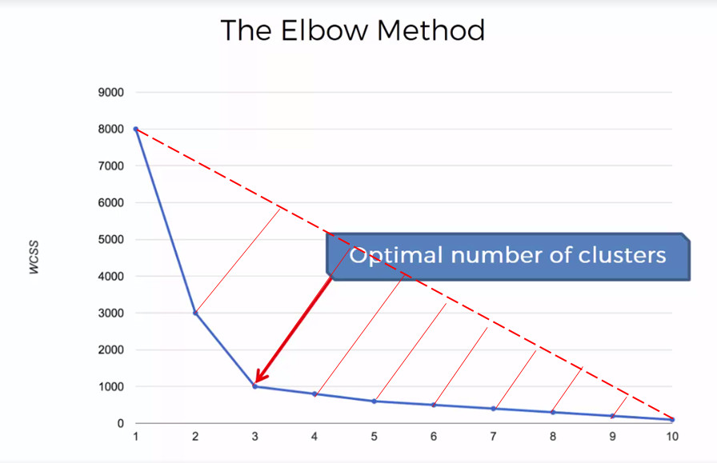

# K-Means Clustering from Scratch — Python & NumPy

This repository contains a **from-scratch implementation of the K-Means clustering algorithm**  
using only **Python and NumPy**, without relying on any machine learning libraries.

The project includes a **realistic synthetic housing dataset**, feature scaling, dimensionality reduction,  
cluster stability analysis, and interpretable cluster profiling — all implemented step by step.

<p>
  
</p>

## 🎯 Goal

To deeply understand:

- How **unsupervised learning** discovers structure in data
- How **distance-based clustering** works internally
- The role of **centroids** and iterative optimization
- Why K-Means is sensitive to **initialization and scaling**
- How to interpret clusters in a **real-world business context**
- How to evaluate clustering quality without labels


## 🧠 Algorithm Overview

K-Means is an **unsupervised, centroid-based, iterative clustering algorithm**.

### Core Idea

1. Choose **K** initial centroids (random initialization)
2. Repeat until convergence:
   - Assign each data point to its **nearest centroid**
   - Update each centroid as the **mean of its assigned points**
3. Stop when centroids no longer move significantly

There is **no concept of labels or training targets** — the structure is discovered purely from data geometry.


## ✏️ Mathematical Intuition

### Distance Metric (Euclidean)

```math
\begin{align}
& \hspace{0cm} \\
& d(x,c)=√(∑(x−c)2)
\end{align}
```

Each point is assigned to the cluster whose centroid minimizes this distance.


<p>
  
</p>


---

### Objective Function (Inertia)

K-Means minimizes the **within-cluster sum of squared distances**:

```math
\begin{align}
& \hspace{22cm} \\
& J=∑∑∣∣xi​−ck​∣∣2
\end{align}
```

This value is called **Inertia** and is used to:

- Evaluate cluster compactness
- Compare different values of **K**
- Apply the **Elbow Method**


## 🏡 Dataset Scenario

- Synthetic housing dataset with **1200 samples**
- Features:
  - Area (m²)
  - Number of Rooms
  - Building Age
  - Distance to City Center
  - Floor
  - Elevator (binary)
  - Parking (binary)
- Designed to mimic **realistic overlap and noise**
- No labels are used (true unsupervised setting)

This dataset allows meaningful **market segmentation** rather than artificial separation.


## 🔍 Preprocessing Steps

- **Feature Scaling (Standardization)**  
  Required because K-Means is distance-based

- **Feature Weighting**
  Feature weighting was intentionally not applied in the base implementation to keep the algorithm behavior transparent.
  This allows future extensions for domain-aware weighting.

- **PCA (optional)**  
  PCA was applied before clustering to reduce dimensionality and noise.
  While this may affect interpretability, it improves cluster compactness and visualization clarity.

<p>
  
  
</p>

## 📊 Model Evaluation & Analysis

### Elbow Method

- Inertia is computed for multiple values of **K**
- The “elbow point” represents diminishing returns in compactness
- Highlights the tradeoff between:
  - Over-segmentation
  - Under-segmentation

<p>
  
  
</p>

---

### Cluster Stability Check

- K-Means is run multiple times with different random initializations
- Observations:
  - Stable clustering → similar partitions with label permutation
  - Unstable clustering → sign of poor K choice or overlapping data


### Cluster Profiling

After clustering, each cluster is interpreted using **mean feature values**:

- Average area, rooms, age, distance
- Percentage of elevator / parking availability
- Enables **human-readable cluster descriptions**

Example outcomes:
- Small, old, distant apartments
- Large, modern, central units
- High-floor, amenity-rich buildings


## ✅ Advantages

- Simple and intuitive algorithm
- Fast convergence on structured data
- Highly interpretable cluster centers
- Excellent for segmentation tasks
- No labeled data required


## ❌ Disadvantages

- Sensitive to feature scaling
- Sensitive to random initialization
- Requires predefined **K**
- Assumes roughly spherical clusters
- Struggles with complex or non-convex shapes


## 🛠 Tech Stack

- Python  
- NumPy (core algorithm and math)  
- Pandas (data handling only)  
- Matplotlib (visualization & diagnostics)  
- Pickle for save and load centroids


## 🚀 Why this project?

This project demonstrates **algorithmic understanding, not library usage**.

It shows my ability to:

- Implement unsupervised algorithms from first principles
- Reason about optimization objectives and geometry
- Handle preprocessing and feature weighting
- Analyze algorithm stability and limitations
- Translate mathematical output into **business-meaningful insights**
